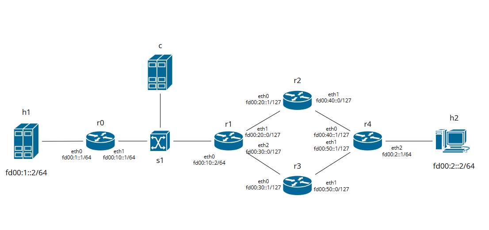
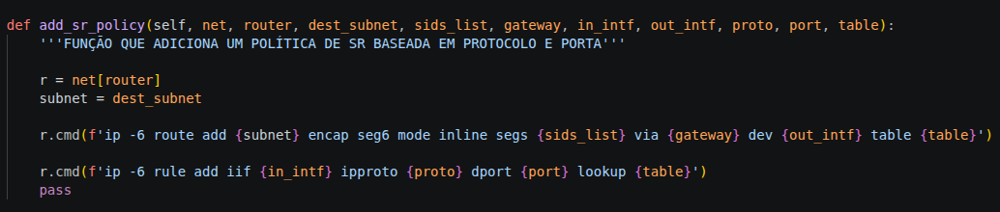
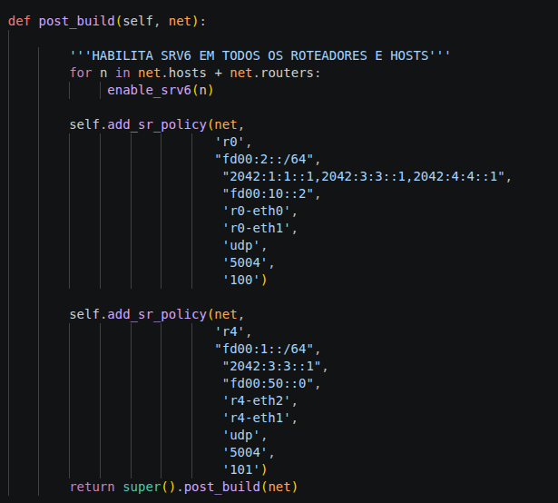

# tcc-mininet
Experimentos no emulador Mininet (com a extensão IP Mininet), compondo meu trabalho de conclusão de curso.

## Comandos

```sudo python3 [arquivo.py]```: executa o código em Python com privilégios de administrador.

```sudo python3 -m ipmininet.clean```: limpa interfaces virtuais, tabelas de roteamente e lixo deixado na execução anterior.

**[LEGADO]** ```sudo mn -c```: limpa interfaces virtuais, tabelas de roteamente e lixo deixado na execução anterior.

## Comandos CLI Mininet

```rX vtysh -c "show ipv6 ospf6 interface"```: mostra interfaces de um host rodando o OSPF, exibindo custos e subredes vizinhas.

```tcpdump not proto 89```: mostra todo o tráfego passando pelo host, com exceção de pacotes do protocolo 89 (OSPF).

## Experimento 1


### Sobre o experimento 1:
O intuito deste experimento demonstrar uma arquitetura de rede capaz de guiar pacotes específicos por rotas diferentes das calculadas pelo protocolo IGP implementado, sem a necessidade de configuração de tabelas de roteamento complexas em múltiplos roteadores.

Na topologia descrita pela imagem I, observa-se a presença de dois caminhos distintos que conectam H1 com H2. O primeiro passa pelo roteador R2 (caminho superior), enquanto o segundo passa pelo roteador R3 (caminho inferior). Os enlace R1 -- R2 e R2 -- R4 têm capacidade de banda igual a 100 Mbps. Já os enlaces R1 -- R3 e R3 -- R4 têm capacidade de 50 Mbps. Através dessas informações, infere-se que o OSPF escolherá o caminho de custo mínimo que passa por R2, já que esse dispõe de mais largura de banda disponível.

No entanto, para fins demonstrativos, foi definido no enlace R2 -- R4 uma latência de 10ms. O OSPF ainda enviaria pacotes pelo caminho superior, dado que o protocolo não foi nativamente pensado para lidar com engenharia de tráfego. Isso representa um problema para aplicações sensíveis à latência, dado que o caminho padrão da rede possui alta latência enquanto há um caminho de baixa latência sub-utilizado.

O Segment Routing sobre IPv6 resolve esse problema na medida em que, apenas injetando configurações na borda da rede, pacotes sensíveis à latência podem ser redirecionados para o caminho de baixa latência, não escolhido normalmente pelo IGP.

### Configurações de SR:



A função SRv6Encap(), nativa do IP Mininet, não lida naturalmente com filtros para protocolos e portas lógicas. Para implementar esta funcionalidade, foi desenvolvida a função add_sr_policy(), que, através de comandos diretamente no kernel do Linux, injeta a regra de Segment Routing dentro de uma tabela de roteamento nova, e associa essa tabela à porta e protocolo especificados.



A função então é chamada no método post_build(), nos roteadores de ingresso da rede, com as regras de redirecionamento de pacotes UDP na porta 5004 através de *R3* (IP de loopback). Note que a escolha do protocolo UDP e da porta 5004 foi arbitrária, visando representar uma aplicação de streaming, posteriormente simulada através da ferramenta *iperf*.

### Executando o experimento:

Para realizar o experimento, foi executado o arquivo ```1_re.py``` através do comando ```sudo python3 1_re.py```. Antes, foi importante garantir que as interfaces lógicas e placas de rede estejam limpas, com```sudo python3 -m ipmininet.clean```.

Depois que a simulação estava em execução, foi necessário esperar o tempo de convergência do OSPF, para garantir que todas as tabelas de roteamento estivessem completas antes de realizar os testes. Para verificar se o roteamento estava funcionando corretamente, foi executado o comando ```h1 ping h2```. Após um ping com sucesso, pôde-se prosseguir com os testes.

Logo, foram abertos individualmente os terminais dos hosts *H1*, *H2*, *R2* e *R3*, através do comando ```xterm [host]```. Nos roteadores, foi executado o comando ```tcpdump not proto 89```, para mostrar o tráfego fluindo por cada roteador, com exceção de pacotes do protocolo OSFP (identificador 89), para fins de visualização.

No terminal do host *H2*, foi executado o comando ```iperf -s -V -u -p 5004```, para abrir um servidor *iperf* utilizando IPv6, através do protocolo UDP na porta 5004.

Já no terminal do host *H1*, foi executado o comando ```iperf -c fd00:2::2 -V -u -p 5004 -t 5 -l 1300```, para invocar um cliente *iperf* utilizando IPv6, através do protocolo UDP na porta 5004, durante o tempo de 5 segundos.

### Resultados obtidos

Ao enviar os comandos supracitados, foi possível observar o tráfego do *iperf* fluindo através de *R3*, em contraste com o tráfego padrão, que antes fluía por *R2* através do menor caminho calculado pelo OSPF. 

A aplicação via UDP na porta 5004 foi então enviada por um caminho de baixa latência, apenas inserindo as configurações em dois nós de borda da rede, através do Segment Routing. Tal comportamento evidencia a utilidade do SR no roteamento inteligente e orientado à engenharia de tráfego de maneira escalável.

